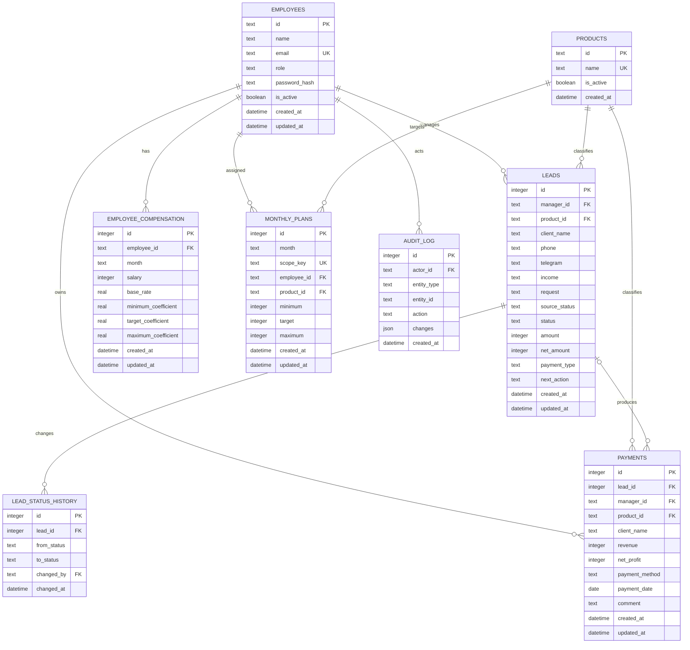

# Схема базы Cursor CRM

## Выбор технологии

Для проекта используется Cloudflare D1 (SQLite). Она подходит для CRM этого масштаба: данные реляционные, нужны фильтрация, сортировка, история изменений и транзакционные пакетные обновления. Локально используется та же SQLite-совместимая схема, поэтому поведение разработки и опубликованной версии совпадает.

## Основные принципы

- денежные значения хранятся целыми рублями (`INTEGER`), без строк с символом валюты;
- месяц хранится как `YYYY-MM`, а дата — как ISO `YYYY-MM-DD`;
- условия сотрудника и планы не перезаписываются: каждая запись привязана к месяцу;
- карточка заявки ссылается на менеджера и тариф по идентификаторам;
- изменение этапа фиксируется отдельно в истории;
- удаление сотрудника в рабочем сценарии заменяется деактивацией, чтобы сохранить финансовую историю;
- часто используемые фильтры обеспечены составными индексами.

## ER-диаграмма

## Таблицы и ответственность

| Таблица | Назначение | Важные ограничения |
|---|---|---|
| `employees` | Пользователи, роли и активность | Уникальный email; роль `manager` или `leader` |
| `products` | Справочник тарифов | Уникальное название |
| `leads` | Нормализованные заявки и текущий этап | Суммы неотрицательные; обязательный менеджер |
| `lead_status_history` | Хронология перемещения по Kanban | Удаляется вместе с заявкой |
| `payments` | Факт выручки и чистой прибыли | Индексы по менеджеру, тарифу, способу и дате |
| `monthly_plans` | Минимальный, целевой и максимальный план | Уникальная пара `месяц + область`; `minimum ≤ target ≤ maximum` |
| `employee_compensation` | Оклад, ставка и коэффициенты сотрудника | Уникальная пара `сотрудник + месяц` |
| `audit_log` | Значимые изменения сущностей | Хранит актёра и JSON изменений |

## Области планов

Поле `scope_key` не допускает неоднозначности SQLite с `NULL` в составных уникальных индексах:

- `department` — общий план отдела;
- `employee:<employee_id>` — персональный план;
- `product:<product_id>` — план продукта.

## Индексы

- `leads(manager_id, status)` — Kanban конкретного менеджера;
- `leads(product_id, status)` — фильтрация доски по тарифу;
- `payments(manager_id, payment_date)` — статистика менеджера за период;
- `payments(product_id, payment_date)` — аналитика тарифов;
- `payments(payment_method, payment_date)` — фильтр по способу оплаты;
- `employee_compensation(employee_id, month)` — получение условий месяца;
- `monthly_plans(month, scope_key)` — выбор плана без полного сканирования.

## Миграция старой версии

Таблица `crm_state` оставлена временно и только для обратимой миграции. Новый API читает и записывает нормализованные таблицы. После проверки переноса производственных данных таблицу можно удалить отдельной миграцией.

## Безопасность

В схеме предусмотрены роли и `password_hash`, но демонстрационная форма входа проекта не является промышленной аутентификацией. До рабочего запуска необходимо подключить серверную идентификацию, хранить только стойкие хэши паролей и проверять права менеджера в каждом API-запросе.
